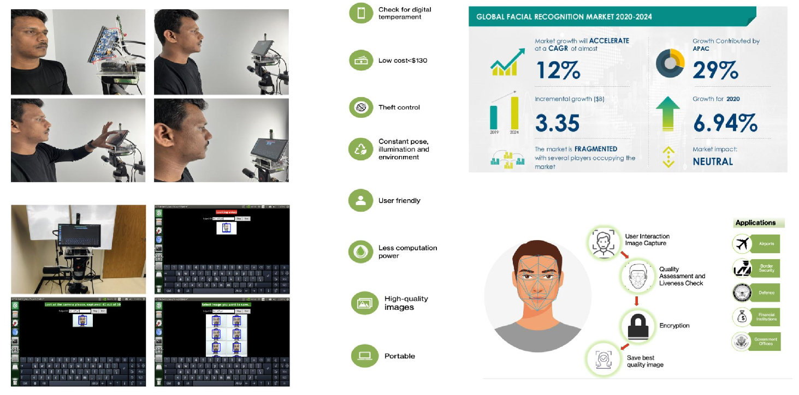

# An Open-Source Face-Aware Capture System
Abstract: Poor-quality facial images pose challenges in biometric authentication, especially in passport photo acquisition and recognition. This study proposes a novel and open-source solution to address this issue by introducing a real-time facial image quality analysis utilizing computer vision technology on a low-power single-board computer.  We present an open-source complete hardware solution that consists of a Jetson processor, a 16MP autofocus RGB camera, a custom enclosure, and a touch sensor LCD for user interaction. To ensure the integrity and confidentiality of captured facial data, Advanced Encryption Standard (AES) is used for secure image storage. Using the pilot data collection, the system demonstrated its ability to capture high-quality images, achieving a 98.98% accuracy in storing images of acceptable quality. This open-source, readily deployable secure system offers promising potential for diverse real-time applications such as passport verification,  security systems, etc



# Getting started with Jetson Nano 
1. Gather necessary components: Jetson Nano Developer Kit 4GB, microSD card (32GB or more), compatible power supply, keyboard, mouse, HDMI-compatible display, and internet connection.

2. Download the latest version of the microSD card flash tool BaenaEtcher from the below link.
https://etcher.balena.io/

3. Download the Jetson Nano Developer Kit SD Card Image, and note where it was saved on the computer.
https://developer.nvidia.com/jetson-nano-sd-card-image

4. Write the image to your microSD card, full instruction is provided for Mac, Linux, and Windows are given here.
https://developer.nvidia.com/embedded/learn/get-started-jetson-nano-devkit#write

5. Power up the Jetson Nano and follow on-screen instructions for initial setup.

# Install dependency
```console
sudo apt-get install python3-tk
sudo apt-get install python3-pil
sudo apt-get install python3-pil.imagetk
pip3 install dlib
pip3 install imutils
pip3 install shapely
python3 -m  pip install cryptography
```
# This system was tested on Python 3.6
# Installation of dlib
```console
wget http://dlib.net/files/dlib-19.21.tar.bz2
tar jxvf dlib-19.17.tar.bz2
cd dlib-19.21/
mkdir build
cd build/
#cmake ..
cmake .. -DDLIB_USE_CUDA=1 -DUSE_AVX_INSTRUCTIONS=1
cmake --build .
cd ../
sudo python3 setup.py install
```
# How to run the code
```console
git clone https://github.com/baset-sarker/face-aware-capture.git
cd face-aware-capture
python3 main.py
```


